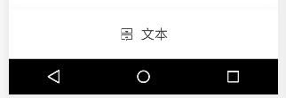
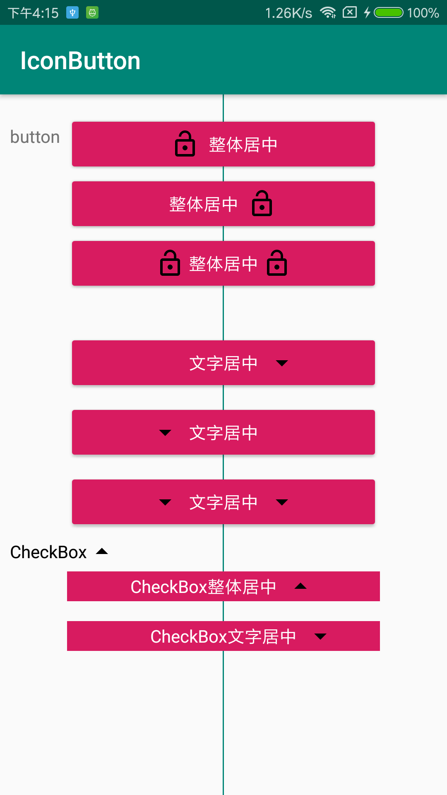

## IconButton


### 特性：
实现Button和CheckBox的文本和compactDrawable整体居中对齐或者文本居中对齐

### 思路

一般的，使用组合控件实现如下的UI效果。




使用这种方式增加了布局层级，而且筛选的样式还需要自己处理箭头的朝向。

IconButton和IconCheckBox使用drawableLeft或者是drawableRight的方式实现，避免了这一问题。IconButton内部通过计算drwablePadding和内部文本、图片元素的宽度计算出剩余空间，对View设置左右padding从而达到居中的效果


### 示例



### IconButton 使用


```
<com.yndongyong.iconbutton.IconButton
        android:id="@+id/btn_center_all"
        style="@style/Widget.AppCompat.Button.Colored"
        android:layout_width="0dp"
        android:layout_height="wrap_content"
        android:drawablePadding="8dp"
        android:drawableLeft="@drawable/  ic_lock_open_black_24dp"
        android:text="整体居中"
        android:textColor="#fff"
        app:dy_centerAnchor="all"
        android:layout_marginTop="16dp"
        app:layout_constraintHorizontal_bias="0.5"
        app:layout_constraintLeft_toLeftOf="parent"
        app:layout_constraintRight_toRightOf="parent"
        app:layout_constraintTop_toTopOf="parent"
        app:layout_constraintWidth_percent="0.7" />
```

文字和图片整体居中
`app:dy_centerAnchor="all"`

文字整体居中
`app:dy_centerAnchor="text"`

### IconCheckBox 使用

```
<com.yndongyong.iconbutton.IconCheckBox
        android:id="@+id/cb_2"
        android:layout_width="0dp"
        android:layout_height="wrap_content"
        android:layout_marginTop="16dp"
        android:background="@color/colorAccent"
        android:button="@null"
        android:drawableRight="@drawable/check_selector"
        android:gravity="center"
        android:text="CheckBox文字居中"
        android:textColor="#fff"
        app:dy_centerAnchor="text"
        android:checked="true"
        android:drawablePadding="8dp"
        app:layout_constraintHorizontal_bias="0.5"
        app:layout_constraintLeft_toLeftOf="parent"
        app:layout_constraintRight_toRightOf="parent"
        app:layout_constraintTop_toBottomOf="@+id/cb_1"
        app:layout_constraintWidth_percent="0.7" />
```

文字和图片整体居中
`app:dy_centerAnchor="all"`

文字整体居中
`app:dy_centerAnchor="text"`
